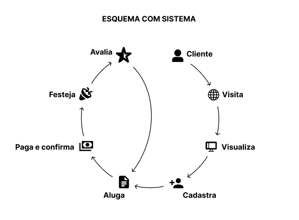
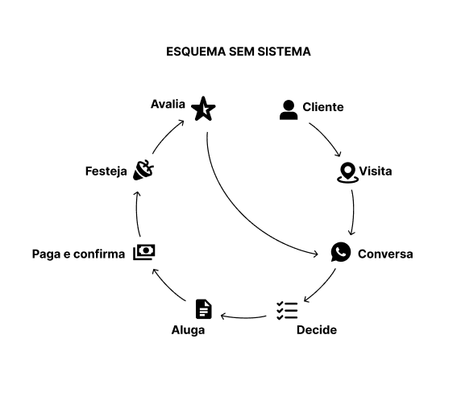
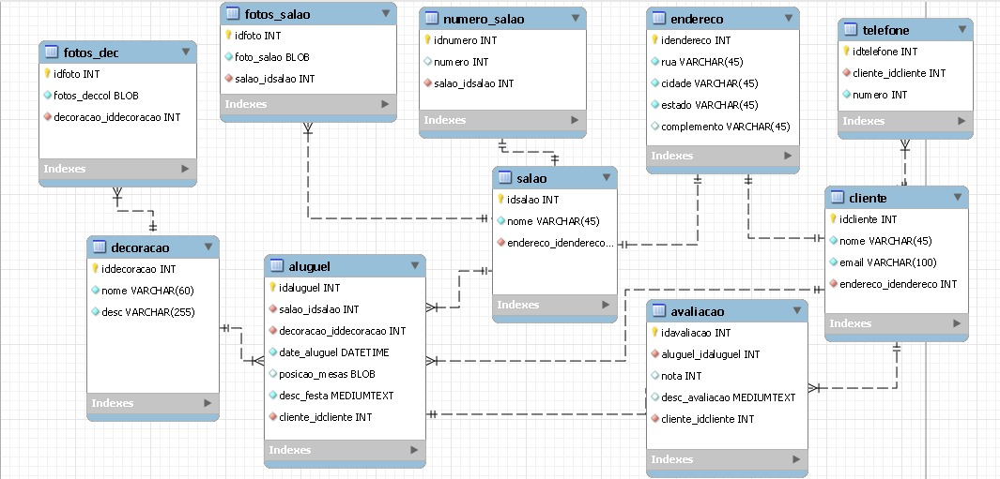

# Sublime Festas e Eventos

Um modelo para o desenvolvimento do Projeto Integrador do Curso de Técnico em Desenvolvimento de Sistemas para a Internet Integrado ao Ensino Médio do IFC - Campus Araquari.

Professor: [Marco André Mendes](github.com/marcoandre)

Equipe:
- [Juliana Luiza dos Santos](github.com/santosjuliana23)
- [Vinicius Gabryel Pereira](github.com/vinyzada)
- [Lucas Gabriel Martins](*)

Links do projeto:
-   [Documentação (Requisitos)](*)
-   Backend: [Repositório](https://github.com/SublimeFestas/Sublime_Back.git) e [Publicação](https://sublime-front.vercel.app/plataform/auth/login)
-   Frontend: [Repositório](https://github.com/SublimeFestas/Sublime_Front.git) e [Publicação](https://sublime-back.onrender.com)

`LOGIN`
- `Email`: vinyescolas@gmail.com
- `Senha`: admin

# 1. Desenvolvimento

**1.1 Modelos de Sistemas**

**Sistema para controle e locação de um salão de festas. O sistema servira tanto para o usuario realizar a locação quanto para o administrador controlar e gerenciar as locações**

# 2. Situação Problema

A empresa Sublime Festas e Eventos, inaugurada no dia 15 de março de 2025, é uma casa de festas localizada na Rua Antenor Douat Baptista, no bairro Ulysses Guimarães, e é especializada em festas infantis. Seu objetivo é tornar o evento mais agradável, oferecendo cozinha equipada, banheiros, espaço kids e ambiente climatizado, com capacidade para 60 pessoas. A empresa também oferece serviços adicionais, como louças de luxo, copeira, monitor e arcos de balões. Andresa e Valdinei são os atuais donos da Sublime, que não possui funcionários fixos, utilizando apenas serviços de terceiros.

A empresa funciona todos os dias da semana, com valores que variam conforme o dia da semana escolhido. Nos finais de semana e feriados, os valores são mais altos. O pacote inclui 5 horas de festa, com a possibilidade de adicionar horas extras por uma taxa adicional. O valor da locação do espaço não inclui alimentação, decoração e serviços adicionais. A empresa oferece mais de 150 tipos de decoração, e os preços variam conforme a decoração escolhida. Caso o cliente deseje, a empresa também disponibiliza bebidas, com valores sob consulta.

Para reservar o local, é necessário o pagamento de 30% do valor adiantado, com o saldo a ser quitado até 10 dias antes do evento. A Sublime, sendo uma empresa recém-inaugurada, realiza todas as negociações e acordos por meio do WhatsApp, o que pode se tornar mais desafiador à medida que o número de clientes aumenta. Com isso em mente, pensamos em um sistema para facilitar as locações e melhorar a visualização dos dados da empresa, tanto para os clientes quanto para os administradores.

# 3. Descrição da proposta

Para solucionar o problema da falta de automação, o sistema deverá realizar quase toda a interação com o cliente, **desde o registro até o pagamento do aluguel**. Além de realizar essa tarefa, o sistema deverá **apresentar o salão de forma clara para quem não o conhece, contendo uma IA que ajude a responder dúvidas e a realizar o aluguel**. O sistema terá dois tipos de usuários: o **cliente e o administrador**. O cliente terá permissão apenas para se cadastrar e realizar o aluguel, enquanto o administrador terá acesso a todos os dados dos clientes, aluguéis e permissão para visualizar um **dashboard com as informações mais importantes**, como o mês com o melhor desempenho, pacotes mais e menos vendidos, aluguéis abertos e concluídos, feedback do salão, decoração mais utilizada, entre outros. Quando o cliente realizar o aluguel, os **administradores receberão um e-mail com os dados do cliente e a data do aluguel**, ficando assim cientes de qualquer locação.

# 4. Modelagem de Dados

# 5. Regras de negócio

##### **RN001 - Cadastro de usuário:** Para cadastrar o usuário, será necessário fornecer as seguintes informações: número de telefone, nome, e-mail e endereço.
##### **RN002 - Cadastro de serviço adicional:** Para cadastrar um serviço, serão requisitadas as seguintes informações: nome do responsável, número do responsável, e-mail do responsável, descrição do serviço e valor.
##### **RN003 - Cadastro de decoração:** Para cadastrar uma decoração, serão requisitadas as seguintes informações: nome da decoração, descrição, fotos, categoria e valor.
##### **RN004 - Locação do espaço:** Para realizar a locação do espaço, o usuário deve estar cadastrado no sistema.
##### **RN005 - Adição de serviços adicionais:** Para incluir um serviço adicional à locação, o serviço deve estar cadastrado no sistema.
##### **RN006 - Seleção de decoração:** Para selecionar uma decoração, a mesma deve estar cadastrada no sistema. O custo da decoração será somado ao valor final, exceto quando a decoração for categorizada como decoração básica.
##### **RN007 - Envio de feedback:** Para realizar um feedback, o usuário deve estar cadastrado no sistema e já ter realizado uma locação no salão escolhido para o feedback.
##### **RN008 - Seleção de salão:** Antes de começar o processo de locação, o usuário deve escolher um salão para o evento. Por padrão, deve ser o salão localizado na Rua Antenor Douat Baptista, no bairro Ulysses Guimarães (Joinville).
##### **RN009 - Configuração do espaço:** O usuário pode posicionar as mesas como desejar no sistema, com limite de 7 mesas e 8 cadeiras por mesa, e um mínimo de 3 mesas e 3 cadeiras por mesa.
##### **RN010 - Período de locação:** Para realizar a locação, o usuário só poderá escolher datas com um período mínimo de 7 dias de antecedência.
###### **RN011 - Cadastro de administrador:** Para realizar o cadastro de um novo administrador primeiro ele deve ser cadastrado como usuário(Cliente) para então outro administrador promovê-lo.
##### **RN012 - Visualização do dashboard:** O administrador terá acesso ao dashboard, onde será mostrado os principais dados do sistema como: número de usuários cadastrados, reservas realizadas, feedbacks e valores de entrada e saída.
##### **RN013 - Cadastro do salão:** Para cadastrar um salão serão requisitadas as seguintes informações: Localização, responsável, foco de atuação(festa infantil ou outro tipo…).
##### **RN014 - Cadastro de foto:** Para cadastrar uma foto serão requisitadas as seguintes informações: A Foto, data da foto e quem fotografou
##### **RN015 - Cadastro de endereço:** Para cadastrar um endereço serão requisitadas as seguintes informações: rua, cidade, estado e complemento não obrigatório.
##### **RN016 - Cadastro de telefone:** Para cadastrar um telefone serão requisitadas as seguintes informações: Número e dono do Número
##### **RN017 - Cadastro de telefone para salão:** Para cadastrar um telefone para o salão serão requisitadas as seguintes informações: Número, nome do responsável e salão correspondente

# 6. Requisitos funcionais
### ENTRADAS
##### **RF001** - O sistema deve manter o **salão**.
##### **RF002** - O sistema deve manter os **clientes**.
##### **RF003** - O sistema deve manter as **reservas**.
##### **RF004** - O sistema deve manter serviços adicionais.
##### **RF006** - O sistema deve manter os **administradores**.
##### **RF009** - O sistema deve manter os **feedbacks**.
##### **RF011** - O sistema deve manter **decorações**.
##### **RF012** - O sistema deve manter o **posicionamento das mesas desejado**.
##### **RF015** - O sistema deve manter as **fotos das decorações**.
##### **RF016** - O sistema deve manter as **fotos do salão**.
##### **RF017** - O sistema deve manter os **números de telefone**.
##### **RF018**  - O sistema deve manter os números de **telefone do salão**.

### PROCESSOS
##### **RF005** - O sistema deve permitir que o **cliente realize reservas**.
##### **RF007** - O sistema deve enviar **emails para os administradores em caso de reserva**.
##### **RF008** - O sistema deve enviar **emails para os clientes em caso de reserva**.
##### **RF010** - O sistema deve restringir os **feedbacks apenas para clientes que já realizaram reserva**.
##### **RF013** - O sistema deve possuir uma **IA para assistência do cliente**.
##### **RF014** - O sistema deve restringir **apenas uma reserva ao dia**.

# 7. Requisitos não funcionais
##### **RNF001 - Design:** O site deve ter um design limpo, com fundo branco e detalhes em verde e dourado.
##### **RNF002 - Navegação:** O sistema deve ser intuitivo e de fácil navegação para os clientes.
##### **RNF003 - Tempo da IA:** O chat com IA deve fornecer respostas rápidas e precisas sobre as principais dúvidas dos clientes.
##### **RNF004 - Dashboard:** O dashboard administrativo deve ter métricas visíveis e organizadas para facilitar a gestão.
##### **RNF005 - Segurança do usuário:** O sistema deve ser seguro para o uso dos os usuários.
##### **RNF006 - Responsividade:** O sistema deve ser possuir responsividade.
##### **RNF007 - Compatibilidade:** O sistema deve ser compatível com todos os navegadores.

# <-------------------FINAL--------------------->

# 8. Diagrama de Caso de Uso

**8.1 Introdução**

O diagrama de caso de uso é uma ferramenta de modelagem que descreve o comportamento de um sistema a partir da perspectiva do usuário. Ele é usado para capturar os requisitos funcionais de um sistema.

- Especificam a visão externa do sistema.
- Descrevem como o sistema é percebido por seus usuários.
- Descrevem as interações entre os usuários e o sistema.

**Os casos de uso:**
- Descrevem como os **usuários interagem com o sistema** (as funcionalidades do sistema)
- Facilitam a **organização dos requisitos** de um sistema.
- Dão uma **visão externa** do sistema
- O conjunto de casos de uso deve ser capaz de comunicar a **funcionalidade** e o **comportamento** do sistema para o cliente.
- Descrevem **o que** o sistema faz, mas **não** especificam **como** isso deve ser feito.

**8.2 Elementos do diagrama de caso de uso**

8.2.1 **Atores**

- Representam os papéis desempenhados por **elementos externos** ao sistema
  - Ex: humano (usuário), dispositivo de hardware ou outro sistema (cliente)
- Elementos que **interagem** com o sistema

Notação:

**Exemplo: Loja de CDs**

**Identificando os atores**
- Uma loja de CDs possui discos para venda. Um cliente pode comprar uma quantidade ilimitada de discos para isto ele deve se dirigir à loja.
- A loja possui um **atendente** cuja função é atender os clientes durante a venda dos discos. A loja também possui um **gerente** cuja função é administrar o estoque para que não faltem discos. Além disso é ele quem dá folga ao atendente, ou seja, ele também atende os clientes durante a venda dos discos.

**E o cliente?**
- Não é ator pois ele **não interage** com o sistema!

**8.2.2 Casos de uso**

- Representam **funcionalidades** do sistema (requisitos funcionais).
- São iniciados por **atores** ou por outros casos de uso.

> **Dica**: nomeie os casos de uso com **verbos** no **infinitivo**.

Notação:

**Exemplo: Loja de CDs**

**Identificando os casos de uso**

- Uma loja de CDs possui discos para venda. Um cliente pode comprar uma quantidade ilimitada de discos para isto ele deve se dirigir à loja. A loja possui um atendente cuja função é atender os clientes durante a **venda dos discos**.
- A loja também possui um gerente cuja função é **administrar o estoque** para que não faltem discos. Além disso é ele quem dá folga ao atendente, ou seja, ele também atende os clientes durante a **venda dos discos**.

**8.2.3 Relacionamentos**

**8.2.3.1 Relacionamento de associação**

- Indica que um ator **participa** de um caso de uso, ou seja, o ator **interage** (comunica-se) com o caso de uso.
- É representado por uma **linha sólida**.
- Um ator pode se relacionar com **um ou mais casos de uso**.

> Dicas:
> - Não use setas nas linhas de associação.
> - Associações não representam fluxo de informação.

**Exemplo: Loja de CDs**

**Identificando os relacionamentos de associação**

- Uma loja de CDs possui discos para venda. Um cliente pode comprar uma quantidade ilimitada de discos para isto ele deve se dirigir à loja. A loja possui um _atendente_ cuja função é atender os clientes durante a **venda dos discos**.
- A loja também possui um _gerente_ cuja função é **administrar o estoque** para que não faltem discos. Além disso é ele quem dá folga ao _atendente_, ou seja, ele também atende os clientes durante a **venda dos discos**.

**8.2.3.2 Relacionamento de generalização/especialização**

**Generalização de atores**

- Quando dois ou mais atores podem se **comunicar com o mesmo conjunto de casos de uso**.
- Indica que um ator **herda** as características de outro ator.
– Um filho (herdeiro) pode se comunicar com todos os casos de uso que seu pai se comunica.

> **Dica:** coloque os herdeiros **embaixo**.

**Notação:**

**Exemplo: Loja de CDs**

**Identificando os relacionamentos de generalização/especialização de atores**

**Generalização de casos de uso**

– O caso de uso filho herda o comportamento e o significado do caso de uso pai.
– O caso de uso filho pode incluir ou sobrescrever o comportamento do caso de uso pai.
– O caso de uso filho pode substituir o caso de uso pai em qualquer lugar que ele apareça.

> **Dica:** deve ser aplicada quando uma condição resulta na definição de
diversos fluxos alternativos.

Notação:

**Exemplo: Loja de CDs**

**Identificando os relacionamentos de generalização/especialização de casos de uso**

**Novos requisitos:**

- As vendas podem ser **à vista** ou **a prazo**. Em ambos os casos o estoque é
atualizado e uma nota fiscal, entregue ao consumidor.
- No caso de uma **venda à vista**, clientes cadastrados na loja e que compram mais de 5 CDs de uma só vez ganham um desconto de 1% para cada ano de cadastro.
- No caso de uma **venda a prazo**, ela pode ser parcelada em 2 pagamentos com um
acréscimo de 20%. As vendas a prazo podem ser pagas no **cartão** ou no **boleto**.
  - Para pagamento com **boleto**, são gerados boletos bancários que são entregues ao cliente e armazenados no sistema para lançamento posterior no caixa.
  - Para pagamento com **cartão**, os clientes com mais de 10 anos de cadastro na loja ganham o mesmo desconto das compras à vista.

**Identificando mais relacionamentos de generalização/especialização de casos de uso**

**8.2.3.3 Relacionamento de dependência**

**Extensão**

- Representa uma variação/extensão do comportamento do caso de uso base.
- O caso de uso estendido só é executado sob certas circunstâncias.
- Separa partes obrigatórias de partes opcionais.
  - Partes obrigatórias: caso de uso base.
  - Partes opcionais: caso de uso estendido.
- Fatorar comportamentos variantes do sistema (podendo reusar este comportamento
em outros casos de uso).

**Notação:**

 - notação")

**Exemplo: Loja de CDs**

**Identificando os relacionamentos de dependência (extensão)**

**Novos requisitos:**
- No caso de uma venda à vista, clientes cadastrados na loja e que compram mais
de 5 CDs de uma só vez ganham um **desconto** de 1% para cada ano de cadastro.
- No caso de uma venda a prazo...
  - ...Para pagamento com cartão, os clientes com mais de 10 anos de cadastro na loja ganham o mesmo **desconto** das compras à vista.

")

**Inclusão**

- Evita repetição ao fatorar uma atividade
comum a dois ou mais casos de uso.
- Um caso de uso pode incluir vários casos de uso.

**Notação:**

 - notação")

**Exemplo: Loja de CDs**

**Novos requisitos:**
Para efetuar vendas ou administrar estoque, atendentes e gerentes terão que **validar** suas respectivas senhas de
acesso ao sistema.

")

**8.2.4 Fronteira do sistema**

- Elemento opcional (mas essencial para um bom
entendimento).
- Serve para definir a área de atuação do sistema, ou seja, seus limites.

**Identificando a fronteira do sistema**

---

